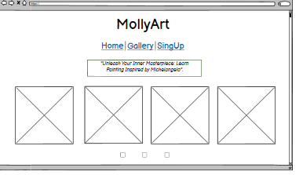
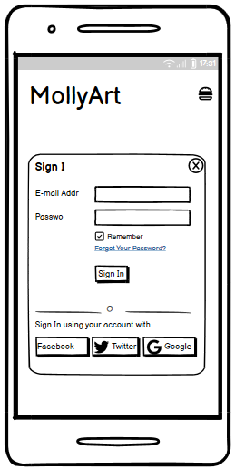
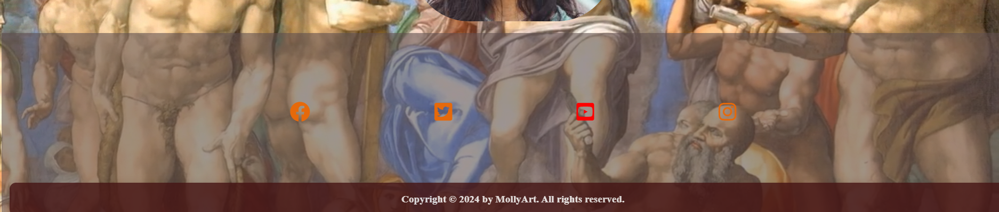
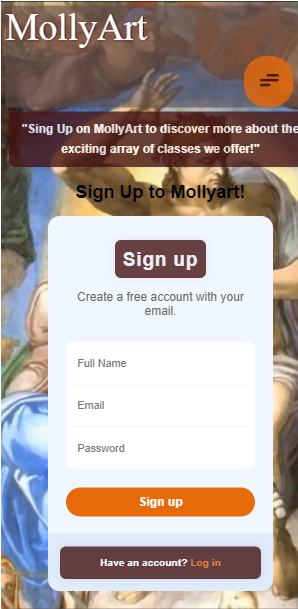
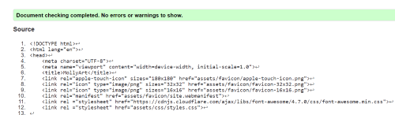
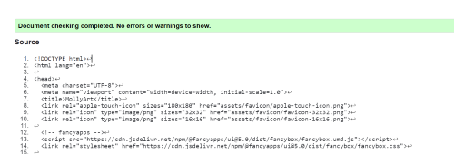

# MollyArt
(By Mirjana Cale)
***

Beneath the title "Unleash Your Inner Masterpiece: Learn Painting inspired by Michelangelo," the _MollyArt _website functions as a lively center for art enthusiasts. MollyArt pulls visitors in for a voyage of creative discovery and development with its enticing layout and captivating content. This platform offers a rewarding experience in the realm of painting education, regardless of your level of competence as an artist.

***
### Live pages - https://mirjanacale.github.io/mollyArt/
***

 
## Introduction

The MollyArt website is a vibrant digital space designed for both beginning and experienced artists. MollyArt's intuitive design encourages people to let their imaginations run wild by giving them the means to produce, share, and discover a wide range of original works of art.

## Responsive Mockup 

Using a mobile-first strategy, this responsive mockup of the Molly Art website ensures smooth screen and device adaptability.

## Existing Features

 
  Our home page greets visitors with a fascinating invitation to "Unleash Your Inner Masterpiece," laying the groundwork for an engaging journey into the realm of art. The gallery page exhibits our students' paintings, and our sign-up page provides a simple registration process, allowing users to readily access exclusive materials, tutorials, and community features geared to their artistic goals.

## Wireframe
***

Wireframe - Homepage Desktop & Mobile
  

 

Wireframe - Gallery page Desktop
  

 

Wireframe - Gallery page Mobile
  

    

Wireframe - SignUp page Desktop
  

 

Wireframe - SignUp page Mobile
  

              

## Color
***
The color scheme for the project is a combination of  _#431313_ dark reddish-brown color and _#e6690a_ bright orange color. 
The color scheme for the website is a combination of soft and warm colors. The background is video.

## Navigation Bar

Users may navigate MollyArt's three pages with ease on any device because to the navigation bar's unifying design. It makes navigating between parts easier without requiring the use of the browser's back button by displaying the logo and links to the Home, Gallery, and Sign Up pages. Desktop users benefit from a traditional navigation bar that maximizes usability across all platforms, while mobile users may easily access content through a hamburger menu.
 

## The landing page image
***

The landing page is the first thing users see when they visit our website. 

### Meet Teatures

Hovering over the photographs reveals information about our professors.

 
 
## The Footer 

Links to the MollyArt art studio's important social media pages can be found in the footer area.  The links will open in a new tab for the user's convenience in navigation.
The user benefits from the footer since it motivates them to maintain social media connections.

## Gallery
***
The gallery page will allow the user to view a display of artwork created by MollyArt studio students, featuring a variety of styles inspired by the ever-evolving Michaelangelo style.

 ## The Sign-Up Page 
 ***
  The user can register with Molly Art on this signup website to find out more about the opportunity to attend classes. The user will be required to enter their email address and complete name.

  

  ## Testing
  ***

  ### **Initial testing plan**

I started by creating a wireframe for my website and then I began coding in HTML, CSS. After that, I tested each :

* Check that all links in the navigation bar work correctly (Home, Gallery, SignUp).
* Check that the email field only accepts valid emails and does not accept invalid ones.
* Check that the form can be submitted without filling out any of the fields.
* Check that pressing enter on a text input submits the form.
* Make sure there are no broken images or missing assets.
* Check responsiveness by resizing the browser window.
* Run tests on different devices/browsers: Chrome, Firefox, Edge. 

## Testing
***
| Page | Test | Pass/Fail |
| :----| :----| :--------:|
| All  | MollyArt logo links back to homepage | Pass |
| All  |  When the mouse hover over an object during navigation, the color changes | Pass |
| All  | Changed color remains beneath the current navigation item after hovering | Pass |
| All  | Navigation links bring the user to relevant page | Pass |
| All  | Footer social media icons bring the user to relevant sites via a new tab | Pass |
| All  | Images and sections are responsive in different media sizes | Pass |
| Index| Images in the index page respond to clicks on the meat overlay | Pass | 
| Menu | The menu items are clear and readable when clicked | Pass |
| SignUp |  SignUp form required elements are responsive | Pass |
| SignUp | Form submit button brings you to a validation page | Pass |

##  Browser  Compatibility

MollyArt is designed to be compatible with  Google Chrome, Mozilla Firefox, Microsoft Edge.

| Broswer tested | Intedend appearance | Screenshot |
| -------------- | :-----------------: | :--------: |
| Chrome         |      Yes            |       |
| Firefox        |      Yes            |       |
| Edge           |      Yes            |       |

##  Responsiveness Testing

MollyArt is designed to be compatible with different device sizes.

| Size     | Intedend appearance | Intended responsiveness | Screenshot |
| -------- | :-----------------: | -----------------------:| :--------: |
| Mobile   |      Yes            |              Yes        |       |
| Tablet   |      Yes            |              Yes        |       |
| Desktop  |      Yes            |              Yes        |       |

## Validator Testing

The MollyArt website was tested using W3C Markup Validation Service (HTML) and Jigsaw by Google (CSS). 

### HTML

The following tools were used for HTML validation:
- [W3C Markup Validation Service](https://validator.w3.org/)

| W3C Link | Screenshot | Notes |
| -------- | :--------: | -----:|
| [index](https://validator.w3.org/nu/?doc=https%3A%2F%2Fmirjanacale.github.io%2FmollyArt%2Findex.html) |  | No errors |
| [gallery](https://validator.w3.org/nu/?doc=https%3A%2F%2Fmirjanacale.github.io%2FmollyArt%2Fgallery.html) |  | No errors |
| [signup](https://validator.w3.org/nu/?doc=https%3A%2F%2Fmirjanacale.github.io%2FmollyArt%2Fsignup.html) |  | No errors |

### CSS

The following tools were used for CSS validation:
 - [W3C Markup Validation Service](https://jigsaw.w3.org/css-validator/).

| Jigsaw Link | Screenshot | Notes |
| ----------- | :--------: | -----:|
| [styles.css](https://jigsaw.w3.org/css-validator/validator?uri=https://mirjanacale.github.io/mollyArt) |  | Notes |

## Lighthouse Testing
***

Lighthouse testing was performed by Google's open source tool, 
[Google Chrome DevTools](https://developers.google.com/web/tools/lighthouse). 

## Unfixed Bugs
***
There are currently no known unfixed bugs in the codebase. If you find any while testing, please report them!

## Deployment

The site was deployed to GitHub Pages. The steps to deploy are as follows:

- In the [GitHub repository](https://github.com/mirjanacale/mollyArt), navigate to the Settings tab 
- From the source section drop-down menu, select the **Main** Branch, then click "Save".
- The page will be automatically refreshed with a detailed ribbon display to indicate the successful deployment.

The live link can be found [here](https://mirjanacale.github.io/mollyArt/)

### Local Deployment

This project can be cloned or forked in order to make a local copy on your own system.

#### Cloning

You can clone the repository by following these steps:

1. Go to the [GitHub repository](https://github.com/mirjanacale/mollyArt) 
2. Locate the Code button above the list of files and click it 
3. Select if you prefer to clone using HTTPS, SSH, or GitHub CLI and click the copy button to copy the URL to your clipboard
4. Open Git Bash or Terminal
5. Change the current working directory to the one where you want the cloned directory
6. In your IDE Terminal, type the following command to clone my repository:
	- `git clone https://github.com/mirjanacale/mollyArt.git`
7. Press Enter to create your local clone.

Alternatively, if using Gitpod, you can click below to create your own workspace using this repository.

Please note that in order to directly open the project in Gitpod, you need to have the browser extension installed.
A tutorial on how to do that can be found [here](https://www.gitpod.io/docs/configure/user-settings/browser-extension).

#### Forking

By forking the GitHub Repository, we make a copy of the original repository on our GitHub account to view and/or make changes without affecting the original owner's repository.
You can fork this repository by using the following steps:

1. Log in to GitHub and locate the [GitHub Repository](https://github.com/mirjanacale/mollyArt)
2. At the top of the Repository (not top of page) just above the "Settings" Button on the menu, locate the "Fork" Button.
3. Once clicked, you should now have a copy of the original repository in your own GitHub account!

### Local VS Deployment

There are no major differences between the local (Gitpod) version and the deployed (GitHub Pages) version that I'm aware of.

## Credits
***

### Content
***
The text for the Home page was written by me, specifically to engage and inform visitors about MollyArt's offers and mission. The Sign Up page has content from Torturous [Future in Tech](https://ictskillnet.ie/courses/), which provides educational and captivating writing to lead users through the registration process. The icons in the bottom were derived from Font Awesome, [Love and Running](https://learn.codeinstitute.net/ci_program/diplomainsoftwaredevelopmentecomm) Site, and they enhance the website's visual appeal and functionality.

### Media
***

The high-quality images that are used to improve the user experience are taken from _Pixabay_and are shown on the home and sign-up pages. Pictures for the gallery page are taken from [Pinterest](https://ie.pinterest.com/), offering a wide range of motivational pieces of art. [HandBrake](https://handbrake.fr/) and Microsoft ClipBar are used to optimize the backdrop video, which is downloaded from [YouTube](https://www.youtube.com/), so that it loads quickly and plays smoothly. Techniques for picture reduction are also used to maximize performance throughout the website.
